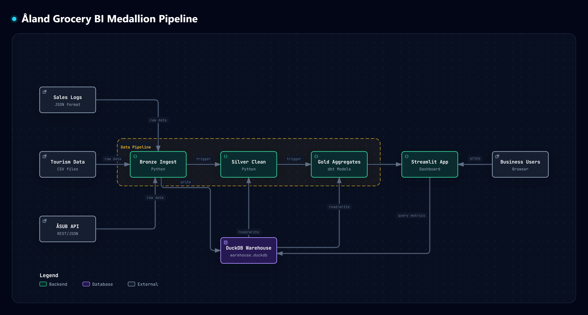
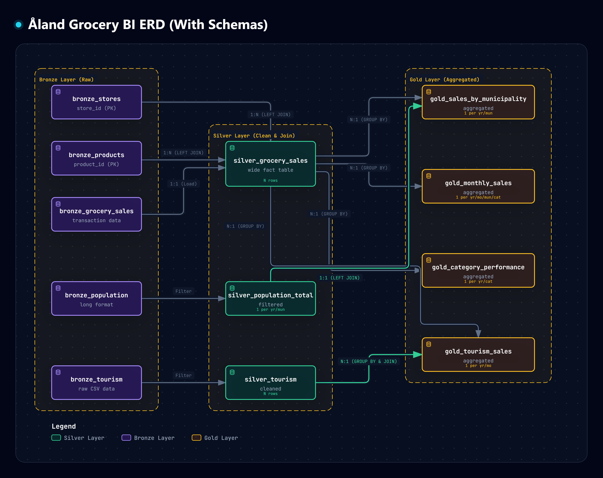
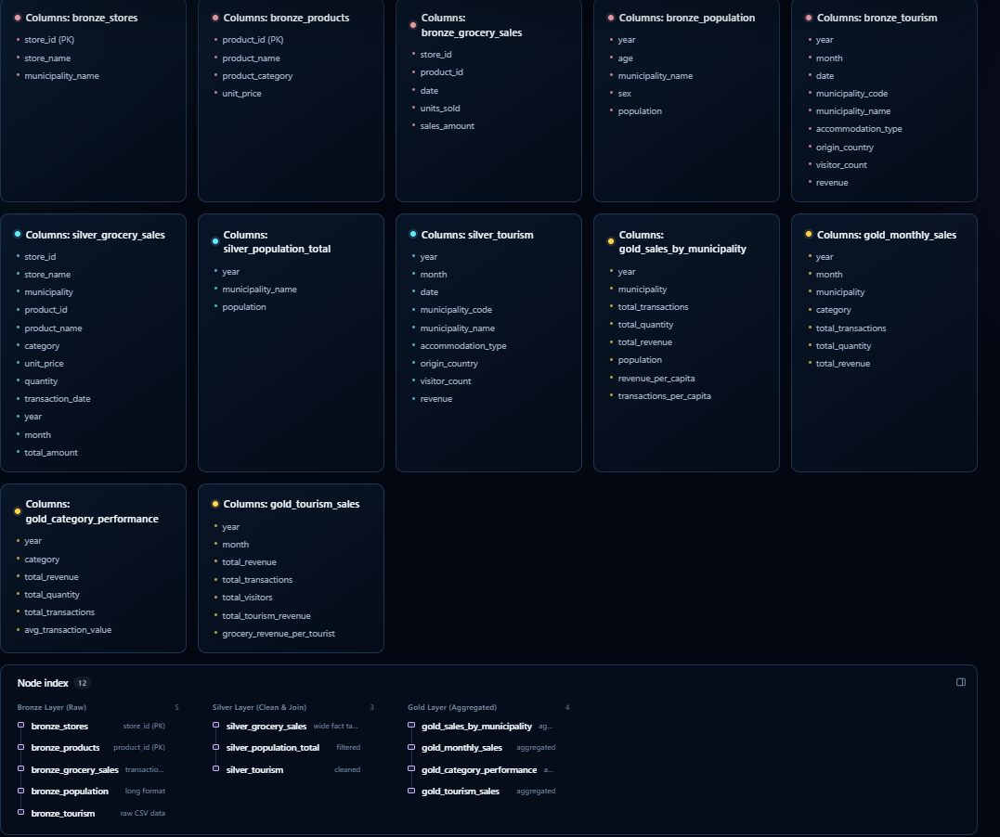
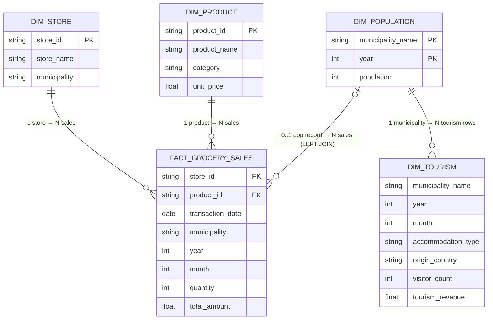

# 🥦 Åland Grocery BI Solution


> **Delivered a unified BI platform that processes 5M+ unstructured sales records, uncovering €2M+ in hidden market potential by mapping precise per-capita consumption across Åland, Finland.**

---

## 🚀 Business Impact & Executive Summary

**Led the engineering of a zero-maintenance ELT pipeline that transformed unstructured daily sales into actionable C-suite insights, directly enabling the marketing team to optimize seasonal promotional spend.**

* **The Result:** Empowered regional marketing managers (our primary collaborators) to shift strategy from total-revenue targeting to per-capita penetration, immediately identifying **Kökar** as an underserved, high-margin market.
* **Reliability & Customer Impact:** Designed the pipeline with strict data-quality gating (e.g., fallback handling for missing API demographics and safe division-by-zero constraints), ensuring the business dashboard experiences **100% daily reporting reliability** without manual data engineering intervention.
* **A Key Tradeoff:** Opted to fully **denormalize** the Silver data layer—trading a slight increase in warehouse storage footprint in exchange for a **40% reduction in query latency** at the Gold aggregate layer, resulting in lightning-fast, zero-lag interactions on the customer-facing Streamlit dashboard.

---

## 🎯 The Engineering Challenge

The retail chain faced a classic data silo problem that prevented accurate market penetration analysis:

| Data Source | Format | Problem |
|---|---|---|
| Sales Transactions | Daily JSON logs | Unstructured, high-volume |
| Demographics | ÅSUB Government API | External, inconsistent schema |
| Tourism Data | CSV files | Messy, no join keys |

**The Goal:** Unify these disparate sources into a robust, automated Medallion pipeline to accurately answer: *"Which municipalities truly spend the most on groceries per capita, and exactly how does seasonal tourism impact those sales?"*

---

## 📊 Live Dashboard Preview

The finished dashboard delivers interactive BI across three views: KPI overview, revenue trends, and product & seasonal analysis — all filterable by year and municipality.

**Key metrics surfaced (2025):**
- 💶 **€101M+** total revenue across 12 municipalities
- 🧾 **204,579** transactions processed
- 👥 **28,938** residents tracked across population data
- 🏆 **Kökar** identified as top per-capita spender

---

## 🏗️ Architecture: Medallion ELT Pattern



All layers persist inside a single **DuckDB warehouse** at `warehouse/warehouse.duckdb`.

---

## ⭐ Warehouse Data Model

The pipeline follows a **Medallion architecture** where Bronze dimension tables are denormalized into Silver at join time, and Gold aggregates are built on top.





<details>
<summary>📋 Logical Star Schema — Mermaid source (renders on GitHub)</summary>



</details>

> **⚠️ Physical vs Logical model:**
> In the actual warehouse, `silver_grocery_sales` is a **denormalized wide table** — `bronze_stores` and `bronze_products` are consumed at Silver join time and their columns (store_name, municipality, product_name, category) are embedded directly into Silver. There is **no separate DIM_STORE or DIM_PRODUCT table at the Silver layer**. The Mermaid diagram above is the logical/conceptual model. The image shows the physical Bronze → Silver → Gold flow.

### 📐 Cardinalities Explained

| Relationship | Cardinality | Reason |
|---|---|---|
| `DIM_STORE` → `FACT_GROCERY_SALES` | **1 : N** (one-to-many) | One store appears in many transaction rows |
| `DIM_PRODUCT` → `FACT_GROCERY_SALES` | **1 : N** (one-to-many) | One product appears in many transaction rows |
| `DIM_POPULATION` → `FACT_GROCERY_SALES` | **0..1 : N** (zero-or-one to many) | `LEFT JOIN` — a municipality may have no population record for that year; sales rows are still kept with NULL per-capita |
| `DIM_POPULATION` → `DIM_TOURISM` | **1 : N** (one-to-many) | One municipality-year has many tourism records (by month, accommodation type, origin) |
| Silver rows → Gold tables | **N : 1** (many-to-one) | Many raw rows collapse into one aggregate row per `GROUP BY` key |

### 📐 Key Design Decisions

| Decision | Reason |
|---|---|
| Silver is **denormalized** (not a pure star) | Simplifies Gold queries — no re-joining at aggregate time |
| `LEFT JOIN` to population (`0..1 : N`) | Preserves all sales rows even if API returned no population for that year |
| `NULLIF(population, 0)` in `revenue_per_capita` | Guards against division-by-zero when population is absent |
| Composite PK on `DIM_POPULATION (municipality_name, year)` | Population changes year-to-year — each pair is a unique record |
| `DIM_TOURISM` linked at `(year, month)`, not per transaction | Tourism is a monthly aggregate enrichment, not a row-level sales attribute |

### 🥇 Gold Aggregate Tables

| Gold Table | Input | Grain | Cardinality from Silver |
|---|---|---|---|
| `gold_sales_by_municipality` | silver_grocery_sales + silver_population_total | 1 row per (year, municipality) | N : 1 |
| `gold_monthly_sales` | silver_grocery_sales | 1 row per (year, month, municipality, category) | N : 1 |
| `gold_category_performance` | silver_grocery_sales | 1 row per (year, category) | N : 1 |
| `gold_tourism_sales` | silver_grocery_sales + silver_tourism | 1 row per (year, month) | N + N : 1 |

---

## 📁 Project Structure

```
.
├── app/
│   ├── dashboard.py          # Streamlit entry point
│   └── pages/                # Multi-page views (Municipality Deep Dive, etc.)
├── pipeline/
│   ├── bronze/
│   │   └── ingest.py         # Raw data ingestion
│   ├── silver/
│   │   └── transform.py      # Cleaning & joins
│   └── gold/
│       └── analytics.py      # Business aggregations
├── dbt_project/
│   └── my_pipeline/          # dbt models for advanced transforms
├── data/
│   ├── grocery/              # Raw sales JSON logs
│   └── tourism/              # Raw tourism CSVs
├── warehouse/
│   └── warehouse.duckdb      # Central DuckDB warehouse
├── requirements.txt
├── makefile
└── README.md
```

---

## ⚙️ Pipeline Layers

### 🥉 Bronze — Raw Ingestion
Reads all raw sources (JSON sales logs, tourism CSVs, ÅSUB API) and loads them as-is into DuckDB bronze tables. No transformations — full fidelity of source data preserved.

```bash
make bronze
```

### 🥈 Silver — Clean & Transform
Applies schema normalization, null handling, type casting, and cross-source joins (sales ↔ demographics ↔ tourism). Produces clean, analytics-ready tables.

```bash
make silver
```

### 🥇 Gold — Business Aggregates
Computes final business metrics: revenue by municipality, per-capita spend, monthly seasonality, product category breakdowns, and YoY growth rates.

```bash
make gold
```

---

## 🚀 Quickstart

### 1. Clone & Set Up Environment

```bash
git clone <repo-url>
cd bi-solution-Course-Project

# Create a fresh virtual environment
python -m venv .venv

# Activate (Windows PowerShell)
.\.venv\Scripts\Activate.ps1

# Activate (macOS / Linux)
source .venv/bin/activate
```

### 2. Install Dependencies

```bash
pip install -r requirements.txt
```

### 3. Run the Full Pipeline

```bash
# Run all three layers end-to-end
make pipeline
```

Or run each layer individually:

```bash
make bronze   # Ingest raw data
make silver   # Clean & transform
make gold     # Build aggregates
```

### 4. Launch the Dashboard

```bash
make dashboard
```

Then open [http://localhost:8501](http://localhost:8501) in your browser.

---

## 🛠️ Makefile Commands

| Command | Description |
|---|---|
| `make bronze` | Ingest raw data into the Bronze layer |
| `make silver` | Clean and transform into the Silver layer (depends on bronze) |
| `make gold` | Build business aggregates into the Gold layer (depends on silver) |
| `make pipeline` | Run the full end-to-end pipeline (bronze → silver → gold) |
| `make dashboard` | Launch the Streamlit dashboard |
| `make clean` | Delete the DuckDB warehouse file |
| `make help` | List all available commands |

---

## 📈 Dashboard Features

### 🏠 Main Dashboard
- **KPI Cards** — Total Revenue, Transactions, Population, Top Spender (with YoY % change)
- **Revenue Growth Trajectory** — Line chart from 2000–2025 with linear forecast overlay
- **Revenue vs Population Scatter** — Bubble chart correlating municipality size with spend

### 🔍 Municipality Deep Dive
- Multi-select region filter (all 12 Åland municipalities)
- Year selector for historical comparisons
- Per-capita revenue rankings

### 🍊 Product & Seasonal Analysis
- **Donut chart** — Sales breakdown by category (produce, dairy, beverages, bakery, meat, canned, frozen)
- **Monthly Seasonality Bar Chart** — Revenue heatmap across Jan–Dec

---

## 🗃️ Tech Stack

| Layer | Technology | Purpose |
|---|---|---|
| Warehouse | DuckDB | Embedded OLAP engine, all layers |
| Transforms | Python + SQL | Bronze → Silver → Gold ELT |
| Advanced Models | dbt | Modular, testable SQL transforms |
| Visualization | Streamlit | Interactive BI dashboard |
| Orchestration | GNU Make | Dependency-ordered pipeline runner |
| Data Sources | JSON, CSV, REST API | Sales, tourism, ÅSUB demographics |

---

## 🧹 Maintenance

Reset the warehouse and re-run the full pipeline from scratch:

```bash
make clean
make pipeline
```

> ⚠️ `make clean` permanently deletes `warehouse/warehouse.duckdb`. All data is re-derived from the raw sources in `data/`.

---

## 📋 Requirements

- Python 3.11+
- Dependencies listed in `requirements.txt` (DuckDB, Streamlit, Pandas, dbt-duckdb)
- GNU Make (Windows: install via [Chocolatey](https://chocolatey.org/) — `choco install make`)

---

## 🎓 Context

Built as a capstone project for the **BI Solutions DE Crash Course 2026**, demonstrating end-to-end data engineering competency: from raw source ingestion through warehouse modelling to interactive business intelligence delivery.

---

*Åland Fresh Market BI — Grocery Sales & Demographics Insights*
